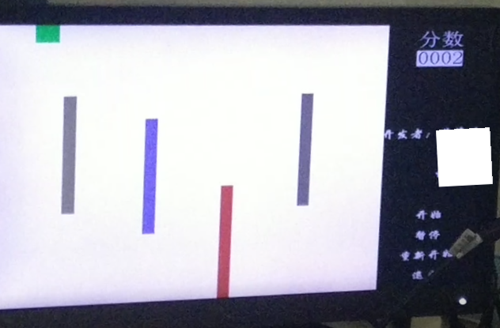

# VerilogDigitalGame
A dodging game by verilog for Digital Circuit Experiment Course Design in HUST, Wuhan, China.
Time: 2018.4.26

> FPGA : NEXYS4 DDR
>
> Display Device
>
> Small Stereo

Details in [Course Design Report](./Report.pdf)

Code in ./AUTOCROSS

**Results**

